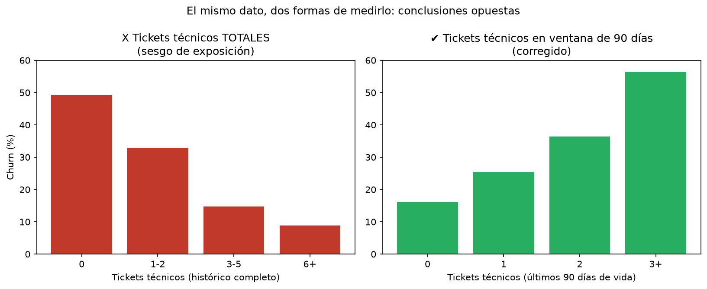

*[English version](README.en.md)*

# Análisis de Retención de Clientes en un ISP

> Identificación de los factores que explican la baja de clientes en un proveedor
> de internet, y priorización de cuentas en riesgo para acción comercial.

<!-- ⬇ REEMPLAZAR por la captura del dashboard cuando esté lista.
     Va acá arriba, antes de cualquier texto: es lo primero que mira un
     seleccionador y muchas veces lo único.
     Guardarla en powerbi/capturas/dashboard_resumen.png -->


**[Ver dashboard interactivo](URL_DE_POWER_BI_SERVICE)** · **[Informe ejecutivo (PDF)](docs/informe_ejecutivo.pdf)**

---

## Contexto

Una cooperativa de telecomunicaciones que presta servicio de internet en la costa
atlántica argentina perdió una parte relevante de su base de clientes en los
últimos 24 meses. La dirección necesita entender el fenómeno para decidir dónde
invertir: ¿es un problema de precio, de competencia, o de calidad de servicio?

**Preguntas de negocio:**

1. ¿Cuál es la tasa de churn mensual y cómo evolucionó?
2. ¿Se concentra en alguna localidad, plan o segmento de cliente?
3. ¿Qué relación hay entre los reclamos técnicos y las bajas?
4. ¿Y entre la morosidad y las bajas?
5. ¿Cuánto ingreso mensual recurrente se perdió?
6. ¿Qué clientes activos hoy están en riesgo y deberían contactarse primero?

> **Nota sobre los datos:** el dataset es **sintético**, generado con el script
> [`generador_datos.py`](generador_datos.py) incluido en este repositorio. No
> proviene de ninguna organización real. El modelo de negocio, las categorías de
> reclamo y la estacionalidad están basados en el funcionamiento habitual del
> sector.

---

## Datos

Cuatro tablas, 24 meses de historia (2024-08 a 2026-07):

| Tabla | Registros | Contenido |
|---|---|---|
| `clientes` | 5.215 | Alta, baja, motivo, plan, localidad, canal de captación |
| `planes` | 6 | Catálogo de planes y precios |
| `facturacion` | 101.300 | Facturación mensual, vencimientos y cobranza |
| `tickets` | 31.341 | Reclamos: categoría, canal, prioridad, resolución, satisfacción |

Diccionario de datos completo en [`docs/diccionario_datos.md`](docs/diccionario_datos.md).

---

## Metodología

| Fase | Herramienta | Qué se hizo |
|---|---|---|
| 1. Modelado e ingesta | SQL Server | Esquema estrella con staging previo; carga masiva desde CSV |
| 2. Control de calidad | SQL Server | 10 controles cuantificados sobre la capa staging |
| 3. Transformación | SQL Server | Limpieza, normalización y carga al modelo final |
| 4. Análisis exploratorio | Python / Pandas | Validación de hipótesis y construcción de la tabla analítica |
| 5. Visualización | Power BI | Modelo dimensional, medidas DAX y dashboard de 3 páginas |

**Decisión de arquitectura:** los datos se ingestan primero en una capa staging
sin tipar y recién se transforman después de medir los problemas de calidad. Esto
permite cuantificar la suciedad del origen en lugar de que la carga falle sin
diagnóstico.

---

## Problemas de calidad encontrados

<!-- ⬇ COMPLETAR con los resultados reales de sql/03_calidad_datos.sql.
     Esta sección es la que más valoran los seleccionadores y la que casi nadie
     escribe. La columna "Decisión" es la más importante: detectar un problema
     es fácil, justificar qué se hizo con él es lo que distingue el criterio. -->

| Problema | Registros | % | Decisión tomada |
|---|---|---|---|
| Filas duplicadas exactas en facturación | 480 | 0,47% | Eliminadas conservando una ocurrencia por `id_factura` (deduplicación con `ROW_NUMBER`). Son duplicados de transporte, no hechos de negocio: dejarlas habría inflado la facturación reportada. |
| Tickets con cliente inexistente | 90 | 0,29% | Aislados en tabla de cuarentena (`rej_tickets_huerfanos`) y excluidos del modelo final. Distribuidos uniformemente entre categorías y períodos, por lo que su exclusión no sesga el análisis. No se eliminan, para preservar trazabilidad. |
| `fecha_pago` en formato inconsistente (dd/mm/yyyy vs. yyyy-mm-dd) | — | — | Unificadas a `DATE` combinando dos intentos de conversión (`TRY_CONVERT` con estilo ISO y estilo dd/mm/yyyy). Crítico: interpretar mal el formato desplaza el pago varios meses y falsea la mora. |
| Montos con error de carga (×100) | 12 | 0,01% | Corregidos dividiendo por 100. Se detectaron comparando cada monto contra 5 veces el precio del plan correspondiente — más robusto que un desvío estándar general. |
| Montos negativos | 34 | 0,03% | **Conservados.** Son notas de crédito, un hecho de negocio legítimo, no un error de carga. |
| `satisfaccion` fuera del rango 1-5 | ~60 | 0,19% | Anulado el valor (`NULL`) conservando el ticket. La gestión del reclamo es válida; lo inválido es la respuesta de la encuesta. |
| Variantes de escritura en `localidad` | 6 reales → ~25 variantes | 13% de las filas | Normalizadas con `TRIM` + eliminación de tildes + mapeo contra catálogo cerrado de 6 localidades. Sin esto, el churn por localidad queda fragmentado y el hallazgo principal no aparece. |
| Variantes de escritura en `tipo_cliente` | 2 reales → 6 variantes | — | Normalizadas con `TRIM` + `CASE` sobre texto en mayúsculas. La collation de la base (case-insensitive) las ocultaba en un `GROUP BY` estándar; se detectaron forzando una comparación binaria (`COLLATE ..._BIN2`). |
| Bajas anteriores al alta (imposible) | 6 | 0,12% | Corregido igualando `fecha_baja` a `fecha_alta`. Los 6 casos son clientes dados de baja en su propio mes de alta: el error estaba en el día, no en el mes. Se conserva el evento de churn en vez de descartarlo, porque excluirlos subestimaría el churn de las cohortes más nuevas — justo donde más se concentra. |
| Nulos en datos de contacto (email/teléfono) | ~9-12% | — | Conservados como `NULL`. No afectan el análisis de retención; solo limitarían una eventual campaña de contacto directo. |

**Sesgo metodológico detectado y corregido:**

Contar **tickets técnicos totales** por cliente sugiere que a más reclamos, *menos* churn (49,3% con 0 tickets vs. 8,8% con 6+). Es un resultado invertido: un cliente que se dio de baja al segundo mes tuvo poco tiempo para generar tickets, mientras que uno con 3 años activo acumuló muchos simplemente por seguir siendo cliente. El conteo total termina siendo un proxy de antigüedad, no de insatisfacción.

La corrección es medir en una **ventana fija de 90 días previos al fin de la relación** (la baja, o la fecha de corte si el cliente sigue activo). Con esa ventana, la relación se invierte y queda coherente con la intuición de negocio: 16,2% de churn con 0 tickets técnicos en 90 días, escalando a 56,5% con 3 o más.



**Limitación conocida, documentada y no resuelta en esta versión:** `mttr_horas` y `csat` en la tabla analítica se calculan sobre el historial completo del cliente, sin la misma corrección de ventana temporal aplicada a los tickets técnicos. Por eso su correlación con `churn` es prácticamente nula (0,03 y -0,01 respectivamente) frente al 0,20 de `tickets_tecnicos_90d`: es probable que ambas variables sufran el mismo sesgo de exposición y que una versión con ventana fija muestre una relación más fuerte. Queda como mejora futura.
---

## Hallazgos principales

1. **Los reclamos técnicos recientes son el predictor más claro de baja.** Los clientes con 3 o más tickets técnicos en sus últimos 90 días activos se dan de baja en un 56,5% de los casos, frente a un 16,2% de quienes no tuvieron ninguno.
2. **La morosidad reciente también anticipa la baja, de forma más gradual.** El churn escala de 18,1% (sin facturas impagas en los últimos 4 meses) a 45,1% (3 o más impagas).
3. **El churn tiene una geografía marcada.** Mar de Ostende (30,5%) casi duplica a Pinamar (17,1%), lo que apunta a una diferencia de infraestructura de red entre zonas, no a un problema comercial generalizado.
4. **Existe una estacionalidad fuerte en marzo y abril.** Esos dos meses concentran un 54% y un 40% más de bajas que el promedio mensual, coincidiendo con el fin de la temporada de verano y la salida de clientes con residencia estacional en la costa atlántica.
5. **La antigüedad no predice el churn de forma lineal.** El grupo de 1 a 3 años de antigüedad (31,7%) churnea más que los clientes de menos de 1 año (28,3%), porque una porción de esa cohorte coincide con su primer o segundo fin de temporada estacional — el efecto del punto 4 se superpone al de la antigüedad simple.

---

## Recomendaciones

1. **Priorizar inversión de red en Mar de Ostende y Valeria del Mar**, las dos localidades con mayor churn (30,5% y 26,0%). Llevarlas al nivel de Pinamar (17,1%) reduciría de forma directa la cantidad de bajas originadas en esas dos zonas.
2. **Reforzar la mesa de soporte técnico en marzo y abril**, anticipando el pico estacional de bajas en vez de reaccionar cuando ya ocurrió. Un cliente con 3+ tickets técnicos en 90 días tiene una probabilidad de baja 3,5 veces mayor que uno sin reclamos.
3. **Activar contacto proactivo de retención sobre clientes activos de alto riesgo** — los que hoy combinan reclamos técnicos recientes y facturas impagas — antes de que pidan la baja, en lugar de actuar solo cuando ya se fueron.

---

## Stack

`SQL Server` · `T-SQL` · `Python` (pandas, matplotlib) · `Power BI` (modelo
dimensional, DAX) · `Git`

---

## Estructura del repositorio

```
analisis-retencion-isp/
├── generador_datos.py          Generación reproducible del dataset sintético
├── datos/
│   ├── raw/                    CSV de origen
│   └── processed/              Tabla analítica a nivel cliente
├── sql/
│   ├── 01_ddl_esquema.sql      Staging + modelo estrella + índices
│   ├── 02_carga_staging.sql    Carga masiva desde CSV
│   ├── 03_calidad_datos.sql    Controles de calidad cuantificados
│   ├── 04_transformacion.sql   Limpieza y carga al modelo final
│   └── 05_analisis.sql         Consultas de negocio
├── notebooks/
│   └── 01_limpieza_eda.ipynb   Análisis exploratorio y validación
├── powerbi/
│   ├── retencion_isp.pbix      Dashboard
│   └── capturas/
└── docs/
    ├── diccionario_datos.md
    └── informe_ejecutivo.pdf
```

---

## Cómo reproducirlo

```bash
# 1. Generar el dataset (opcional: ya está en datos/raw/)
python generador_datos.py

# 2. Crear el esquema
sqlcmd -S .\SQLEXPRESS -d retencion_isp -E -i sql/01_ddl_esquema.sql

# 3. Cargar los datos (editar antes la ruta en el script)
sqlcmd -S .\SQLEXPRESS -d retencion_isp -E -i sql/02_carga_staging.sql

# 4. Calidad, transformación y análisis
sqlcmd -S .\SQLEXPRESS -d retencion_isp -E -i sql/03_calidad_datos.sql
sqlcmd -S .\SQLEXPRESS -d retencion_isp -E -i sql/04_transformacion.sql
```

Requisitos: SQL Server 2019+, Python 3.10+ (`pandas`, `numpy`), Power BI Desktop.

---

## Autora

<!-- ⬇ COMPLETAR con nombre y LinkedIn -->

**[Nombre]** — [LinkedIn](URL)
